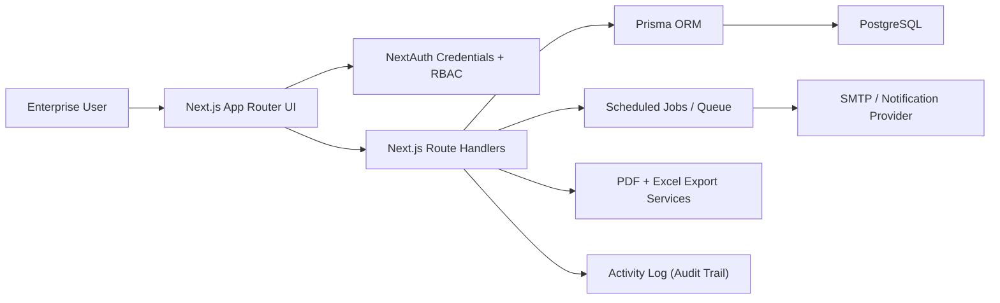

# Strategic Projects Portal Plan

## Architecture Diagram

## Milestones

### Milestone A: Auth + RBAC + Base Layout
- Status: `Completed`
- Tasks:
  - Implement NextAuth login with role claims
  - Add server-side RBAC guards for admin and protected routes
  - Build responsive portal shell (left nav + top bar)
  - Deliver dashboard skeleton and role-aware nav
- Acceptance criteria:
  - Login works with demo users
  - `/dashboard`, `/submissions`, `/reports` are auth-protected
  - `/admin` is restricted to `ADMIN`
  - Role and session data are exposed via `/api/me`

### Milestone B: Database Schema + Migrations + Seed
- Status: `In Progress`
- Tasks:
  - Define Prisma schema for all required entities (`In Progress`: RBAC-centric schema added for `User`, `Project`, `ProjectAssignment`, `Approval`, `AuditLog` with role/stage enums and sponsor object-id fields)
  - Add migration and seed data scripts (`In Progress`: migration `20260221_rbac_access_control` and Prisma seed script with 7 role-based users + 10 sample projects + assignments + approvals + audit entries delivered; `npm run db:seed` wired. `Update`: added staging-focused Prisma seed script `/prisma/seed.ts` with all required test personas and `npm run db:seed:staging` command.)
  - Add reference data tables for configurable workflow metadata
- Acceptance criteria:
  - PostgreSQL schema includes all core entities and relationships
  - Seed produces realistic demo users/projects/dependencies (`Update`: staging user seed now covers submitter, sponsors, governance users, PM user/admin, and admin personas.)

### Milestone C: Submissions CRUD + Dynamic Form
- Status: `In Progress`
- Tasks:
  - Build submissions list with server-side pagination/filter/search (`In Progress`: Projects table now includes color-coded Stage badges (Proposal/Funding Request/Change Request) with stage sort/filter controls)
  - Build create/edit dynamic submission form with autosave drafts (`In Progress`: tabbed PowerApp-style intake with overview/sponsor/characteristics/financials delivered, including auto-calculated Payback/NPV/IRR; Funding Requests now open in Business Case mode with section labels A/B/C/D aligned to Project Overview/Resource Requirements/Financial Plan/Metrics & KPIs, and now persist a dedicated Business Case field model (Introduction, Overview, Scope/Schedule, Strategy Alignment, Resource Requirements, User Experience, Risk/Mitigation, Investment/Regulation, Benefit Realization, Metrics/KPIs, Opportunity Summary, P&L Impact); Financial Plan now includes workbook-style P&L Impact rows with dynamic fiscal columns and auto-calculated summary totals; draft save ownership enforced from authenticated user so saved drafts remain visible/editable in Projects table; server pagination pending)
  - Add detail page tabs shell
- Acceptance criteria:
  - Submitter can create/edit/submit drafts
  - Conditional form sections based on request type/category

### Milestone D: Workflow + Approvals + Activity Log
- Status: `In Progress`
- Tasks:
  - Add transition engine with validation rules (`In Progress`: centralized lifecycle workflow engine now enforces proposal/funding lifecycle statuses (`DRAFT` -> `AT_SPONSOR_REVIEW` -> `AT_PGO_FGO_REVIEW` -> `AT_SPO_REVIEW` and `FR_DRAFT` -> `FR_AT_SPONSOR_APPROVALS` -> `FR_AT_PGO_FGO_REVIEW` -> `FR_APPROVED`), with server-side locking for non-draft records and submitter-edit restrictions enforced in `PATCH /api/submissions/[id]`)
  - Implement approvals actions and comments (`In Progress`: `ApprovalRequest` entity/store now drives in-app queues, stage decisions, sponsor/delegate acting context, and workflow reconciliation; queue actions route through `/api/projects/:id/approve|reject` using request IDs for strict per-request authorization)
  - Deliver dedicated Finance Hub view (`In Progress`: finance-only operations board route/nav shipped; both hubs now bucket cards into To Do / In Progress / Closed, with task assignee controls replacing card comments)
  - Deliver Project Management Dashboard operations view (`In Progress`: PM Hub now has a new executive dashboard layer (7 tabs) with server-side analytics APIs, drilldown drawer, and global filtering while preserving existing PM assignment + operations/task-board section)
  - Add in-context governance metadata editor (`In Progress`: Project Governance cards now open a characteristics-only popup editor backed by a role/stage-gated API route)
  - Build structured Change Management workflow for approved/delivery projects (`Completed`: Added `ChangeRequest` lifecycle (`DRAFT` -> `SUBMITTED` -> `UNDER_REVIEW` -> `APPROVED` -> `IMPLEMENTED`/`CLOSED` + `REJECTED`), before/after field deltas, impact/severity scoring, comment/attachment thread, server-side approval gating, implementation path that applies approved deltas to locked projects only, immutable audit entries, and required APIs under `/api/change-requests/*` + `/api/projects/:id/change-log`)
  - Write activity logs for key actions (`In Progress`: submission-level immutable audit trail now persists create/update/workflow/reassignment events; centralized governance audit log now captures key admin/workflow/SPO actions with admin review endpoint/UI, including role changes, active-state changes, sponsor updates, approval decisions, and SPO-to-funding workflow transfers)
- Acceptance criteria:
  - Invalid stage/status transitions are blocked
  - Approval actions are auditable

### Milestone E: Dashboard Analytics + Exports
- Status: `In Progress`
- Tasks:
  - Implement KPI and segmented charts (`In Progress`: enterprise multi-layer strategic intelligence dashboard delivered with Operational/Strategic/Analytical/Tactical/Contextual views; PM Hub now also has dedicated executive analytics tabs with KPI cards, schedule/SLA/risk/resource/value visuals and click-to-drill filtering backed by `/api/pm-dashboard/*`)
  - Add filtered Excel exports and per-project PDF generation
  - Add export history UI
- Acceptance criteria:
  - Dashboard metrics align with persisted data
  - PDF and Excel downloads succeed for authorized users

### Milestone F: Notifications + Ops Automation
- Status: `In Progress`
- Tasks:
  - Submit/approval/reminder notifications (`In Progress`: notification provider interface now emits in-app notifications plus Outlook/Teams outbox placeholders for approval requests and workflow transitions. `Update`: added staging safe mode routing via `APP_ENV=staging` that keeps in-app notifications enabled, redirects email to staging sink, and disables or redirects Teams based on staging config.)
  - Scheduled reminder jobs for stale items
- Acceptance criteria:
  - Submission and approval requests trigger email notifications (`Update`: staging-safe notification controls available via env vars)
  - Under-review reminders fire after threshold

### Milestone G: Admin Config + Workflow Rules UI
- Status: `In Progress`
- Tasks:
  - Manage reference lists and workflow transitions (`In Progress`: dropdown reference list management shipped)
  - Add admin pages for role assignments (`In Progress`: user management migrated to centralized role-type + active-state updates with RBAC-derived access preview; legacy checkbox rights path removed from primary admin flow)
- Acceptance criteria:
  - Admin can update workflow rules without code changes

### Milestone H: Hardening + Tests + README
- Status: `In Progress`
- Tasks:
  - Add unit tests for workflow validation and CaseID generation (`In Progress`: RBAC matrix tests added for own/assigned/all scopes, sponsor approval entitlements, sponsor no-edit guarantee, admin full access; API auth guard test added for forbidden server-side denial; PM dashboard analytics tests now cover assigned-visibility enforcement and KPI snapshot computation)
  - Apply security hardening and upload constraints
  - Finalize README, scripts, and deployment notes (`In Progress`: added staging deployment package with `vercel.json`, GitHub Actions staging deploy workflow, staging env runbook (`docs/STAGING_DEPLOYMENT.md`), staging-only `/staging-guide` UI, and test-credential generation script.)
- Acceptance criteria:
  - Test suite passes (`Current`: `npm run test` passing)
  - Lint/build pass (`Current`: `npm run lint`, `npm run typecheck`, `npm run build` passing; lint has two non-blocking `next/image` warnings in `components/portal-shell.tsx`)
  - Setup and verification steps are documented (`Update`: staging-specific setup and validation checklist documented.)

### Milestone I: Project Copilot (LLM + Persistence + Streaming UI)
- Status: `In Progress`
- Tasks:
  - Add Copilot persistence models in Prisma (`CopilotConversation`, `CopilotMessage`, `CopilotArtifact`, `CopilotFeedback`, `CopilotAuditLog`, `Project`) (`Completed`)
  - Add secured App Router APIs for chat/templates/history/feedback/artifacts with zod validation and audit logging (`Completed`)
  - Implement provider routing with Azure OpenAI preference and OpenAI fallback (`Completed`)
  - Build streaming Copilot UI panel with quick actions, history, artifact cards, export, and insert hooks (`Completed`)
  - Embed Copilot in STRATOS floating launcher and dedicated page (`Completed`)
  - Upgrade Copilot to schema-first STRATOS workflow with canonical artifact modes (`TASK_REWRITE`, `SUBTASKS`, `RISK_REGISTER`, `KPI_SET`, `EXEC_SUMMARY`, `PROJECT_INSIGHTS`), strict project-context injection, role-aware generation guardrails, and `/api/copilot` structured response contract (`In Progress`)
- Acceptance criteria:
  - Streaming replies render in UI and persist to conversation history
  - Structured artifacts are stored and retrievable by conversation/project
  - Auth + project access checks are enforced on all Copilot endpoints
  - Copilot can run in fallback mode when no model credentials are configured

### Milestone J: Reports Studio (Self-Service Reporting Framework)
- Status: `In Progress`
- Tasks:
  - Build `/reports` into a full Reports Studio with dedicated pages for Home, Builder, Template Library, Viewer, and Admin dataset governance (`Completed`)
  - Add centralized reporting backend domain (`lib/reporting/*`) for dataset registry, report/template persistence, versioning, sharing, run engine, and deterministic insights (`Completed`)
  - Implement full `/api/reporting/*` API surface for datasets, reports, templates, run/clone/share, and exports with server-side permission checks (`Completed`)
  - Add sample report/template content (6 reports) and demo export artifacts in `/exports` (`Completed`)
  - Upgrade export stack to true XLSX/PPTX library generation when package network access is available (`Pending`)
- Acceptance criteria:
  - Users can build table-driven reports with row/column/value/filter layout and preview runs against approved datasets (`Completed`)
  - Users can save reports, save templates, clone, and share with viewer/editor permissions (`Completed`)
  - Reports produce deterministic insights and support download actions for report/raw/chart outputs (`Completed`)
  - Server-side RBAC and dataset permission enforcement is active on all reporting APIs (`Completed`)
